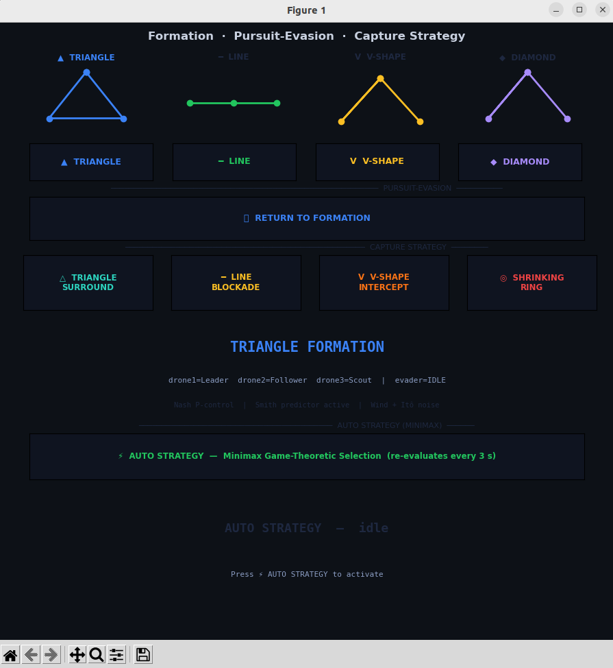
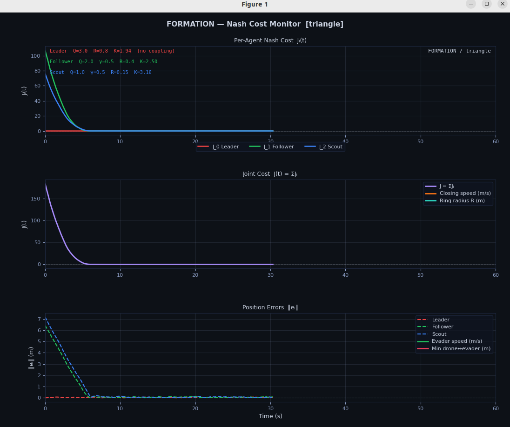

# Drone Swarm: Differential Games for Multi-Robot Control

ROS2 Humble · Gazebo Classic · Python 3.10

A quadrotor swarm that implements two regimes of differential game theory on real simulated hardware:
**cooperative Nash formation control** and **zero-sum Isaacs pursuit-evasion with cooperative surround**.

---

## Demo Videos

### Nash Formation Control


### Line Blockade: Capture


### Triangle Surround: Capture


### Shrinking Ring: Capture


### Auto Minimax Strategy: Adaptive Switching


### Pursuit-Evasion

`<!-- INSERT VIDEO/GIF -->`

---

## GUI Control Panel

The formation UI launches automatically with the simulation.
It publishes `std_msgs/String` to `/formation_cmd` and subscribes to `/surround_status` and `/auto_strategy_scores` for live feedback.



### Controls

**Formation section** (four shape buttons with live mini-previews):

| Button | Command | Shape |
|---|---|---|
| TRIANGLE | `triangle` | Equilateral, 2 m side |
| LINE | `line` | 3 drones on a horizontal axis |
| V-SHAPE | `v_shape` | V opens rearward |
| DIAMOND | `diamond` | Extended V with longer tail |

**Pursuit-Evasion section:**

| Button | Command | Effect |
|---|---|---|
| RETURN TO FORMATION | `return` | Abort pursuit/surround, re-enter last formation |
| Pursuit (send via terminal) | `pursuit` | drone1 chases; drone2+3 trail in Nash formation |

**Capture Strategy section** (four surround geometries):

| Button | Command | Description |
|---|---|---|
| TRIANGLE SURROUND | `triangle_surround` | Equal ring, shrinks inward |
| LINE BLOCKADE | `line_blockade` | Wall perpendicular to evader heading |
| V-SHAPE INTERCEPT | `v_intercept` | Tip ahead of evader, wings trailing |
| SHRINKING RING | `shrinking` | Each drone orbits its own lane, radius decreases |

**Auto Strategy section:**

| Button | Command | Effect |
|---|---|---|
| AUTO STRATEGY | `auto_surround` | Minimax selects and switches strategy every 3 s |

The status panel shows the active mode, Nash gains, Smith predictor state, and, on capture, a `CAPTURED` flash with the winning strategy name.

---

## Live Cost Plotter

A three-panel live plot that adapts to the current mode.
Runs at 10 Hz over a 60-second rolling window.



### Formation mode panels

| Panel | Signal | Description |
|---|---|---|
| 1 | `Jᵢ(t)` | Per-agent Nash cost (position error + coupling penalty) |
| 2 | `J(t) = ΣJᵢ` | Joint cost, converges to zero at equilibrium |
| 3 | `‖eᵢ‖` | Raw position errors: leader-to-anchor, followers-to-slot |

The gain annotations shown on Panel 1:

```
Leader    Q=3.0  R=0.8   K=1.94  (no coupling)
Follower  Q=2.0  γ=0.5   R=0.4   K=2.50
Scout     Q=1.0  γ=0.5   R=0.15  K=3.16
```

### Pursuit mode panels

| Panel | Signal | Description |
|---|---|---|
| 1 | `dᵢ(t)` | Distance of each drone to the evader |
| 2 | `−ḋ₁(t)` | Closing speed of drone1 (positive = closing in) |
| 3 | `‖v_ev‖` | Evader speed estimate (EMA-smoothed) |

### Surround mode panels

| Panel | Signal | Description |
|---|---|---|
| 1 | `fₛ(t)` | Escape fraction per strategy (auto mode) or ring radius (manual) |
| 2 | `R(t)` | Surround ring radius, decreasing toward minimum |
| 3 | `min dist` | Minimum drone↔evader distance + capture threshold line |

---

## Architecture

```
/formation_cmd  (std_msgs/String)
       │
       ▼
┌─────────────────────┐     /droneN/cmd_vel     ┌─────────────────────┐
│ FormationController │ ───────────────────────▶ │  DroneController    │
│  Nash formation     │                          │  (×4 instances)     │
│  Isaacs pursuit     │ ◀─── /droneN/odom ──── │  PD altitude        │
│  Minimax surround   │                          │  P velocity         │
└─────────────────────┘                          │  Itô noise          │
       │ /surround_status                         │  Actuation delay    │
       │ /auto_strategy_scores                    └─────────────────────┘
       ▼                                                   ▲
┌─────────────────────┐                          ┌─────────────────────┐
│   FormationUI       │                          │    WindNode         │
│   CostPlotter       │                          │  bias + sinusoidal  │
└─────────────────────┘                          │  gusts per drone    │
                                                  └─────────────────────┘
       ▲
       │ /evader/odom
┌─────────────────────┐
│  EvaderController   │
│  gap-escape policy  │
│  OU noise jinking   │
└─────────────────────┘
```

**Control rates:**
- Formation controller: 20 Hz (`DT = 0.05 s`)
- Drone controller (inner loop): 100 Hz (`DT = 0.01 s`)
- Cost plotter / UI: 10 Hz update, 200 ms animation

---

## Mathematical Foundations

### 1. Differential Games

A differential game couples `n` agents through shared state dynamics:

```
ẋ = f(x, u₁, u₂, ..., uₙ)
```

Each agent `i` has its own cost functional:

```
Jᵢ = ∫₀^∞  Lᵢ(x, u₁, ..., uₙ) dt
```

Because objectives are separate, the solution is an **equilibrium**, not an optimum.
Two regimes are implemented here:

| Regime | Objective structure | Solution concept |
|---|---|---|
| Cooperative | `J₁, J₂, J₃` partially aligned | Nash equilibrium |
| Zero-sum | `J_pursuer = −J_evader` | Minimax / Isaacs saddle point |

---

### 2. Nash Formation Control

#### Cost functional

Each drone minimizes:

```
Jᵢ = ∫₀^∞  [ Qᵢ · eᵢ²  +  γᵢⱼ · eᵣₑₗ²  +  Rᵢ · uᵢ² ] dt
```

where:
- `eᵢ = pᵢ − target_i`: position error to own slot
- `eᵣₑₗ = (pᵢ − pⱼ) − (Δᵢ − Δⱼ)`: **relative-spacing error** to neighbour j
- `γᵢⱼ`: coupling weight, how much drone i pays for the relative gap being wrong
- `Rᵢ`: control effort penalty

The coupling matrix `γ`:

```
GAMMA = [ 0.0  0.3  0.3 ]   # row i = drone i, col j = coupling to drone j
        [ 0.8  0.0  0.5 ]
        [ 0.6  0.5  0.0 ]
```

`γ` is what makes this a game rather than three independent controllers:
drone 2 actively corrects its spacing relative to drone 3, not just its own offset from the leader.

#### Solving for Nash gains

System model (single integrator, velocity command controls position directly):

```
ẋ = u      →     A = 0,  B = 1
```

The Continuous Algebraic Riccati Equation for this scalar system:

```
−P²/R + Q̃ = 0     →     P = √(Q̃ · R)     →     K = P/R = √(Q̃/R)
```

The effective cost weight `Q̃ = Qᵢ + γᵢⱼ` folds the coupling into each agent's ARE.
Nash equilibrium means neither agent can reduce its cost by changing its gain unilaterally.

**Computed gains at startup:**

| Agent | Q | γ | R | K |
|---|---|---|---|---|
| Leader (drone1) | 3.0 | n/a | 0.80 | 1.94 |
| Follower (drone2) | 2.0 | 0.5 (→ scout) | 0.40 | 2.50 |
| Scout (drone3) | 1.0 | 0.5 (→ follower) | 0.15 | 3.16 |

#### Control law

**Leader:**
```
v_leader = −K₀ · (p₁ − p_target)
```

**Followers** (two terms):
```
vᵢ = −Kᵢ · (pᵢ − (p_leader + Δᵢ))          ← track own slot
   − γᵢⱼ · 0.4 · ((pᵢ − pⱼ) − (Δᵢ − Δⱼ))  ← correct relative spacing
```

The second term is absent in independent P-control.
With it, the followers maintain shape relative to each other, not only relative to the leader.

#### Formation geometries

Offsets `[dx, dy]` from drone1 (world frame):

```python
FORMATION_OFFSETS = {
    'triangle': [[-1.0, -1.732], [ 1.0, -1.732]],   # √3 ≈ 1.732, equilateral
    'line':     [[-2.0,  0.0  ], [ 2.0,  0.0  ]],
    'v_shape':  [[-2.0, -2.0  ], [ 2.0, -2.0  ]],
    'diamond':  [[-2.0, -3.0  ], [ 2.0, -3.0  ]],
}
```

Switching formation only swaps the offset table. The Nash gains and control law are identical across all shapes.

#### Smith predictor (delay compensation)

Actuation delay = 30 ms (3 steps × 10 ms). Without compensation this destabilizes the loop.
The Smith predictor simulates `SMITH_STEPS = 3` steps ahead before computing the gain:

```
pred_p = p + v(p) · DT    (repeated 3 times)
v_cmd  = control_law(pred_p)   ← act on predicted future state
```

This removes the delay from the closed-loop characteristic equation.

---

### 3. Zero-Sum Pursuit-Evasion (Isaacs)

#### The game

```
J_pursuer = −J_evader     (one side's gain = the other's loss)
```

Isaacs' Hamilton-Jacobi-Isaacs equation for minimum time-to-capture:

```
min  max  [ 1 + ∇V · f(x, u_p, u_e) ] = 0
 u_p  u_e

V(x) = value function = optimal time-to-capture from state x
```

The `L = 1` running cost makes V decrease at unit rate along the optimal trajectory.
Solving this PDE over the full state space is computationally intractable in real time.

#### Pursuer: pure pursuit (tractable approximation)

```
v_drone1 = V_PURSUIT · (p_evader − p_drone1) / |p_evader − p_drone1|
```

Always head directly at the target at maximum speed.
Net closure rate: `1.3 − 1.1 = 0.2 m/s`, the fundamental tension this approximation exposes.

Drone2 and drone3 trail in Nash formation behind drone1, covering flanks.

#### Evader: weighted repulsion + Ornstein-Uhlenbeck noise

**Base policy: weighted escape direction:**

```
escape = normalize( Σᵢ  (wᵢ / dᵢ) · (p_evader − pᵢ) )

weights: drone1 = 3.0 (primary pursuer),  drone2 = drone3 = 1.0
```

Closer drones feel more threatening (inverse-distance weighting).
drone1 is weighted 3× because it is the active pursuer.

**Perturbation: Ornstein-Uhlenbeck process:**

```
dx = −θ · x · dt + σ · dW

θ = 3.0   (mean-reversion rate, τ = 1/θ ≈ 0.33 s)
σ = 0.25  (noise intensity)
```

OU noise is temporally correlated, smooth, realistic lateral jinking that is statistically unpredictable but physically plausible. Not memoryless white noise.

The OU component is projected onto the **perpendicular** of the escape direction - the evader always moves away from pursuers while jinking sideways:

```
v_evader = V_EVADE · escape_dir + ou_lateral · perp_dir
```

---

### 4. Cooperative Surround & Capture

When single pursuit is insufficient (speed ratio close to 1), 3 drones cooperatively close all escape directions.

#### Surround slot positions

**Triangle Surround:** equal spacing on a shrinking circle:
```
slot_k = p_evader + R(t) · [cos(2π·k/3),  sin(2π·k/3)]     k = 0, 1, 2
```

**Line Blockade:** wall perpendicular to evader heading:
```
heading = evader_velocity / |evader_velocity|
perp    = [−heading.y,  heading.x]
ahead   = p_evader + (LINE_AHEAD_BASE + R) · heading
slots   = [ahead + spread·perp,  ahead,  ahead − spread·perp]
```

**V Intercept:** tip ahead of evader, wings trailing:
```
slots = [p_evader + 2.5·heading,
         p_evader − 1.5·heading + spread·perp,
         p_evader − 1.5·heading − spread·perp]
```

**Shrinking Ring:** each drone orbits its own lane, radius decreases:
```
R(t)     = max(R_min,  R_init − shrink_rate · t)
           = max(1.5,   2.2    − 0.07 · t)          ← closes in ~10 s

target_i = p_evader + R(t) · [cos(θᵢ₀ + ω·t),  sin(θᵢ₀ + ω·t)]

ω = 0.12 rad/s   (orbit rate)
θᵢ₀ = initial angle for drone i, evenly spaced 120° apart to prevent crossing
```

#### Optimal slot assignment (Hungarian, brute-force)

At strategy start, drones are assigned to slots by minimizing total travel distance.
With 3 drones and 3 slots, all `3! = 6` permutations are checked:

```
assignment* = argmin_{perm}  Σᵢ |drone_i.pos − slot[perm(i)]|
```

#### Surround control law

```
vᵢ = −Kᵢ · (pᵢ − target_i)      ← Nash P-control to slot
   + 0.4 · v_evader              ← 40% feedforward (tracks moving evader)
   + repulsion from evader        ← hard exclusion zone (SAFETY_RADIUS = 1.3 m)
   + repulsion from other drones  ← soft separation (DRONE_SEP_MIN = 1.1 m)
```

#### Capture conditions (strategy-specific)

| Strategy | Metric | Threshold | Condition |
|---|---|---|---|
| Triangle Surround | Triangle area (m²) | 3.5 | Evader inside triangle AND area < threshold |
| Shrinking Ring | Max angular gap (°) | 135° | Gap < threshold; no open escape arc |
| V Intercept | Wing separation (m) | 3.0 m | Wings close enough to block exit |
| Line Blockade | Max inter-drone gap (m) | 1.5 m | Line has no traversable gap |

---

### 5. Auto Minimax Strategy Selection

When `auto_surround` is active, the system selects the strategy that minimizes the evader's escape probability. Re-evaluated every 3 seconds.

#### Escape fraction (containment heuristic)

For each candidate strategy, 72 escape directions are sampled (every 5°).
A direction θ is **blocked** if any drone can intercept before the evader escapes:

```
direction θ blocked  ←→   min_i |slot_i − esc_pt| / V_SURROUND  ≤  D_SAFE / V_EVADE

D_SAFE      = 5.0 m    (escape distance)
V_SURROUND  = 1.8 m/s  (drone speed in surround mode)
V_EVADE     = 0.75 m/s (evader nominal cruise speed)

escape_fraction(s) = unblocked directions / 72
```

The strategy with the **lowest escape fraction** is selected:

```
s* = argmin_s  escape_fraction(s)
```

**Important caveats:**
- This is a geometric containment heuristic, not an approximation of the HJI value function V(x).
- The metric assumes a uniform-random evader direction. The actual evader best-responds via gap scoring; a learning evader could exploit this mismatch.
- The intercept test uses `V_EVADE = 0.75 m/s`; the evader sprints at `1.2 m/s` through large gaps; the model is optimistic during sprints.

#### Evader gap escape in surround mode

```
score(gap) = gap_angle × harmonic_mean(d_left, d_right)

harmonic_mean = 2 · d_left · d_right / (d_left + d_right)
```

Wide gap beside far-away drones scores highest, genuinely safer than a wide gap beside a close drone.

Three behavioral states:

| State | Gap threshold | Speed | OU jink scale |
|---|---|---|---|
| Sprint | > 140° | 1.2 m/s | 30% |
| Cruise | 75°–140° | 0.85 m/s | 100% |
| Fallback | < 75° | 0.85 m/s | 100% → flee nearest drone |

---

### 6. Disturbances

#### Itô actuator noise (pursuers)

Applied in [drone_controller.py](src/drone_swarm/drone_swarm/drone_controller.py) at 100 Hz:

```
Fₓ += N(0,  (MASS · σ / √dt)²)
Fy += N(0,  (MASS · σ / √dt)²)
```

Memoryless white noise, modelling rotor vibration and aerodynamic turbulence.
Per-drone intensity: `σ = [0.08, 0.15, 0.22]` (Leader most stable, Scout noisiest).

#### Wind (deterministic sinusoidal gusts)

Applied in [wind_node.py](src/drone_swarm/drone_swarm/wind_node.py) at 20 Hz:

```
F_wind_x(i) = bias_scale · WIND_BIAS[i][0]  +  gust_scale · A[i] · sin(ω[i]·t + φ[i])
F_wind_y(i) = bias_scale · WIND_BIAS[i][1]  +  gust_scale · A[i] · cos(ω[i]·t + φ[i]·0.7)

Gust amplitudes A: [0.08, 0.15, 0.22] N
Gust frequencies ω: [0.8, 0.6, 1.0] rad/s
```

Wind is independent per drone (different amplitudes, frequencies, phases).
`bias_scale` and `gust_scale` are tunable at runtime via `/wind_scale`.

Wind is applied **after** the delay buffer; it acts on the drone regardless of the delayed command.

#### Actuation delay

Each drone has a 30 ms actuation delay (`delay_steps = 3` at 100 Hz).
Implemented as a FIFO deque; the command published 3 cycles ago is what gets applied.
Compensated in the formation controller by the Smith predictor.

---

## Installation

**Prerequisites:** ROS2 Humble, Gazebo Classic 11, Python 3.10

```bash
cd ~/drone_swarm_ws
rosdep install --from-paths src --ignore-src -r -y
colcon build --packages-select drone_swarm
source install/setup.bash
```

---

## Running

**Launch everything** (Gazebo + all nodes + UI + plotter):

```bash
ros2 launch drone_swarm drone_gazebo.launch.py
```

Startup sequence (automated):
1. Gazebo loads with the drone world
2. Drones spawn staggered (1.2 s apart) from scattered positions
3. Controllers start at t = 8 s; drones converge to triangle formation
4. Formation UI and Cost Plotter open at t = 13 s

**Manual commands** (alternative to the UI):

```bash
# Formation shapes
ros2 topic pub --once /formation_cmd std_msgs/String "data: 'triangle'"
ros2 topic pub --once /formation_cmd std_msgs/String "data: 'line'"
ros2 topic pub --once /formation_cmd std_msgs/String "data: 'v_shape'"
ros2 topic pub --once /formation_cmd std_msgs/String "data: 'diamond'"

# Pursuit-evasion
ros2 topic pub --once /formation_cmd std_msgs/String "data: 'pursuit'"
ros2 topic pub --once /formation_cmd std_msgs/String "data: 'return'"

# Surround strategies (manual)
ros2 topic pub --once /formation_cmd std_msgs/String "data: 'triangle_surround'"
ros2 topic pub --once /formation_cmd std_msgs/String "data: 'line_blockade'"
ros2 topic pub --once /formation_cmd std_msgs/String "data: 'v_intercept'"
ros2 topic pub --once /formation_cmd std_msgs/String "data: 'shrinking'"

# Auto minimax
ros2 topic pub --once /formation_cmd std_msgs/String "data: 'auto_surround'"
```

**Wind control** (runtime adjustment):

```bash
# bias_scale=1.0, gust_scale=3.0 → hurricane gusts
ros2 topic pub --once /wind_scale std_msgs/Float64MultiArray "data: [1.0, 3.0]"

# Disable wind
ros2 topic pub --once /wind_scale std_msgs/Float64MultiArray "data: [0.0, 0.0]"
```

---

## Node Reference

| Executable | Node name | Role |
|---|---|---|
| `drone_controller` | `drone_controller` | Inner-loop flight controller (×4) |
| `formation_controller` | `formation_controller` | Nash formation + pursuit + surround |
| `evader_controller` | `evader_controller` | Gap-escape + OU noise evasion |
| `wind_node` | `wind_node` | Per-drone sinusoidal wind disturbances |
| `formation_ui` | `formation_ui` | Matplotlib control panel |
| `cost_plotter` | `cost_plotter` | Live Nash cost / game metric plotter |

## Key Topics

| Topic | Type | Publisher | Subscribers |
|---|---|---|---|
| `/formation_cmd` | `String` | `formation_ui` | `formation_controller`, `evader_controller`, `cost_plotter` |
| `/droneN/cmd_vel` | `Twist` | `formation_controller` | `drone_controller` |
| `/droneN/odom` | `Odometry` | Gazebo | All nodes |
| `/evader/odom` | `Odometry` | Gazebo | `formation_controller`, `evader_controller`, `cost_plotter` |
| `/surround_status` | `Float64MultiArray` | `formation_controller` | `formation_ui`, `cost_plotter` |
| `/auto_strategy_scores` | `Float64MultiArray` | `formation_controller` | `formation_ui`, `cost_plotter` |
| `/droneN/wind_force` | `Wrench` | `wind_node` | `drone_controller` |
| `/wind_scale` | `Float64MultiArray` | user / `wind_controller` | `wind_node` |

---

## Parameters

| Parameter | Default | Node | Description |
|---|---|---|---|
| `hover_altitude` | `1.0` m | `drone_controller` | Altitude setpoint |
| `noise_sigma` | `0.08–0.22` | `drone_controller` | Itô noise intensity σ |
| `delay_steps` | `3` | `drone_controller` | Actuation delay in control cycles |

---

## Key Constants

| Constant | Value | Location | Meaning |
|---|---|---|---|
| `V_MAX` | 1.2 m/s | `formation_controller` | Formation mode speed cap |
| `V_PURSUIT` | 1.3 m/s | `formation_controller` | Pursuer speed |
| `V_SURROUND` | 1.8 m/s | `formation_controller` | Surround mode speed cap |
| `V_EVADE` | 1.1 m/s | `evader_controller` | Pursuit mode evader speed |
| `V_EVADE_SPRINT` | 1.2 m/s | `evader_controller` | Surround sprint speed |
| `SURROUND_RADIUS_INIT` | 2.2 m | `formation_controller` | Initial ring radius |
| `SURROUND_RADIUS_MIN` | 1.5 m | `formation_controller` | Minimum ring radius |
| `SHRINK_RATE` | 0.07 m/s | `formation_controller` | Ring closure rate |
| `SAFETY_RADIUS` | 1.3 m | `formation_controller` | Hard evader exclusion zone |
| `SMITH_STEPS` | 3 | `formation_controller` | Steps ahead in Smith predictor |
| `AUTO_EVAL_INTERVAL` | 3.0 s | `formation_controller` | Minimax re-evaluation period |
| `N_ESCAPE_DIRS` | 72 | `formation_controller` | Sampled directions (5° resolution) |

---
